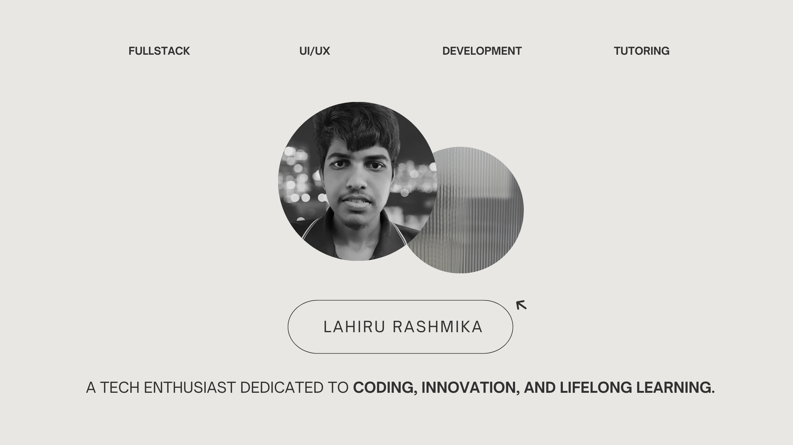

  

  

- 💬 Ask me about **Full stack Web Development and Mobile Development**

- 📫 How to reach me **kklahirumatara@gmail.com**

<h4 align="right">Connect with me:</h4>

## 🛠 Tech Stack  

<table width="100%" align="center">
  <tr>
    <td valign="top" width="20%">

### 🎨 Frontend  
  
  
  
  
  
  
  

   </td>
   <td valign="top" width="20%">

### 🚀 Backend  
  
  
  
  
  

   </td>
   <td valign="top" width="20%">

### 💡 Languages  

  
  
  
  

   </td>
   <td valign="top" width="20%">

### 📦 Databases  
  
  
  

   </td>
   <td valign="top" width="20%">

### 🎨 Design & Tools  
  
  
  

   </td>
  </tr>
</table>

&nbsp;

 
 
 
 
 
 
 

